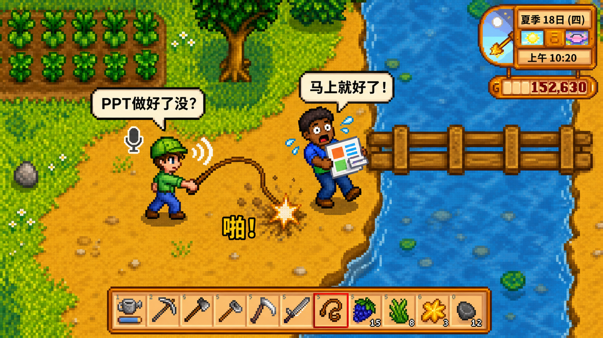

# DSH AGH Work Orchestrator

`dsh-agh-work-orchestrator` 是从 AI Native Game Harness（AGH）中独立出来的通用 DSH 工作编排插件。它让陪伴角色先完成当前对话回复；回复结束后，后台识别器再判断用户是否提出了需要长期处理的通用工作。命中后，插件创建或恢复一个独立 Worker DSH Session，并把公开更新交回原陪伴 Session。

`AGH` 是 `AI Native Game Harness` 的缩写。GitHub 仓库使用 AGH 品牌名，运行时包名保持为 `@qimidandapigu/dsh-work-orchestrator`，便于其他角色和产品复用。

本项目不建立任务中心，不创建 WorkTask 数据库，也不维护第二套任务状态机。工作事实、对话记录和成果仍由 DSH Session 与其 Workspace 保存。

当前版本：`0.1.4`。本仓库发布的是 Git 源码版本；尚未声明已经发布到 npm。

## 产品宣传页



- 参赛人员：**小汤圆**
- 小组：**回家玩游戏！！**

我们相信，未来的人不该被工作界面困住。玩家继续玩游戏，通过语音向 NPC 说明目标；NPC 连接 AI 与办公工具，在独立 Worker DSH Session 中持续完成工作、主动汇报，并把最终成果保存在 Workspace。

核心交互是**游戏内语音 + 小皮鞭动作**，不是打字聊天框：玩家按住说话交代任务，用小皮鞭催办，NPC 通过语音和头顶气泡回应。

同一通用编排层可以通过游戏 Adapter 服务星露谷物语、缺氧、饥荒联机版等不同游戏。Worker Session 会优先使用 DSH 中已经安装并启用的生产力工具；DSH 官方提供 Claude Code 与 Codex subagent Provider，外部产品仍需在部署环境中单独安装和认证。

直接打开 [site/index.html](site/index.html) 查看完整中文产品宣传页。本地预览：

```powershell
python -m http.server 4173 --directory site
```

产品定位、用户旅程和事实依据见 [docs/PRODUCT_VISION.md](docs/PRODUCT_VISION.md)。

## 为什么单独建仓库

本仓库在 2026 年 8 月 28 日 18:00（Asia/Shanghai）之后建立，用于实现一个有明确边界的新创意。既有 AI Native Game Harness 是公开、可追溯的上游基础，不会伪装成本项目的新代码。完整边界见 [UPSTREAM_BASE.md](UPSTREAM_BASE.md)。

## 当前已经实现

- 陪伴角色回答完成后再做工作意图识别，不阻塞首字和语音回复。
- `start`、`continue`、`inspect` 与保守的 `none` 四类意图。
- 一个陪伴 Session 关联并复用同一个 Worker DSH Session。
- 只持久化 Session 关联，不保存第二份任务内容或状态。
- 重启后恢复原 Worker Session；恢复失败时保留关联并明确报告，不静默新建任务。
- Worker 的公开回复回传给原陪伴 Session，再由调用方配置的角色身份汇报。
- 兼容旧的 `xiaotangyuan-work-*` Session 与关联文件。
- 关闭服务时等待后台识别任务并释放 Worker Session。
- 通过 Cordis patch 作为独立 DSH 插件安装。

## 本地验证

要求 Node.js 22.19+ 与 pnpm 10.28.2：

```powershell
pnpm install --frozen-lockfile
pnpm check
```

## 接入方式

在 DSH Runtime 中安装本包并应用 `cordis.patch.yml`。调用方注入 `workOrchestrator` 服务，只在陪伴角色公开回复结束后调用 `scheduleTurn()`，并传入角色资料与通知回调。

最重要的时序要求是：先把陪伴角色当前回复交给用户，再调用 `scheduleTurn()`。该方法只入队后台识别并立即返回，不应阻塞当前回复。

```ts
ctx.workOrchestrator.scheduleTurn({
  companionSessionId,
  playerText,
  companionReply,
  selection,
  source: 'voice',
  companion: {
    id: 'xiaotangyuan',
    name: '小汤圆',
  },
  notify: update => sendWorkUpdateToClient(update),
})
```

完整配置和调用契约见 [docs/INTEGRATION.md](docs/INTEGRATION.md)，架构与恢复行为见 [docs/ARCHITECTURE.md](docs/ARCHITECTURE.md)，AI Native Game Harness 的薄接线边界见 [integration/README.md](integration/README.md)。

## 验证边界

`pnpm check` 当前覆盖 TypeScript 构建与 4 个本地测试：配置约束、回答后识别与同 Session 复用、重启恢复、旧小汤圆关联迁移。它不等同于真实模型、真实语音、Desktop 通知或最终 HTML 产出的端到端验证。

版本变化见 [CHANGELOG.md](CHANGELOG.md)。

## License

MIT
